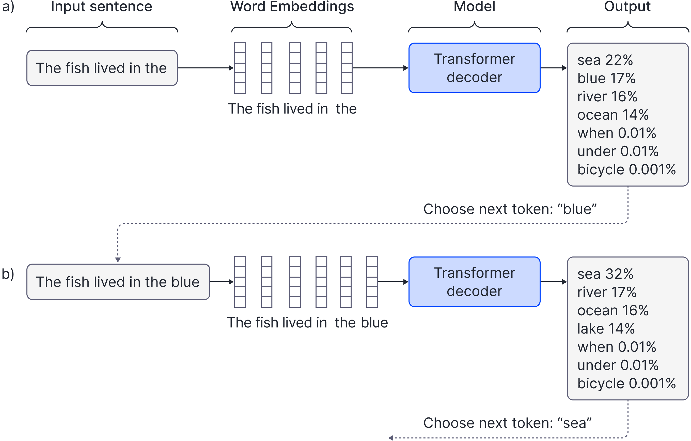

# \o/

Olá! Bem-vindo ao curso de AI Engineering do CodsLab.

## O que é este curso?

Imagine alguns problemas:

- uma conversa entre médico e paciente precisa ser transformada em um rascunho estruturado do registro clínico, que será revisado por um profissional;
- uma solicitação de devolução exige consultar o pedido, a política da loja, o pagamento e o estoque antes de decidir o próximo passo;
- um advogado precisa encontrar casos semelhantes em milhares de documentos, mesmo quando eles descrevem a mesma ideia com palavras diferentes.

Podemos construir aplicações com componentes de IA para ajudar em cada um desses problemas: extrair informações de uma conversa, coordenar etapas entre sistemas ou buscar documentos por significado.

Todas podem usar modelos de IA, mas cada uma precisa de decisões diferentes. O que vamos pedir ao modelo? Que informações ele receberá? Quem pode executar uma alteração? Como saber se o resultado está bom?

Durante este curso, são nessas decisões que nos concentraremos, com um propósito: como construir aplicações que possuem componentes de IA? Continuamos trabalhando com APIs, bancos de dados, testes e observabilidade. Agora, porém, parte do comportamento do software depende de um modelo probabilístico, que pode interpretar algo de maneira incorreta.

Nosso objetivo será dar uma visão inicial sobre a área de **AI Engineering**, que se preocupa em construir essas aplicações e justificar suas escolhas. Ao longo do curso, implementaremos integrações e conheceremos técnicas para fornecer contexto, avaliar resultados e controlar ações. Também veremos quando uma solução mais simples já resolve o problema.

A construção da primeira aplicação começa na próxima aula. Por enquanto, vamos entender as decisões que darão sentido ao código :)

# O que é AI Engineering?

Sendo uma área recente, existem várias definições para o termo. Um texto do MIT Professional Education oferece uma definição ampla:

> AI engineering is the process of combining systems engineering principles, software engineering, computer science, and human-centered design to create intelligent systems that can complete certain tasks or reach certain goals. — [MIT Professional Education](https://professionalprograms.mit.edu/blog/technology/artificial-intelligence-engineering/)

Essa descrição inclui sistemas inteligentes de vários tipos. Para delimitar o recorte deste curso, usaremos uma definição mais específica:

> AI Engineering é a aplicação de fundamentos de engenharia de software à construção de sistemas cujo comportamento depende, em parte, de modelos de IA.

Continuamos com as preocupações usuais de engenharia de software, mas passamos também a integrar APIs de modelos, implementar sistemas de RAG, construir avaliações e desenvolver agentes, entre outras coisas.

## Relações com outras áreas

Você pode pensar: “Qual a diferença entre AI Engineering e ML Engineering?”

As fronteiras não são absolutas, e há bastante sobreposição de conhecimento e atuação. ML Engineering costuma concentrar-se no ciclo de vida dos modelos e dos dados: preparação de datasets, feature engineering, treinamento ou adaptação, avaliação, deployment e monitoramento. No recorte deste curso, partiremos principalmente de modelos já treinados e nos concentraremos na aplicação construída ao redor deles. Você também encontrará cargos como “AI/ML Engineer”, refletindo essa sobreposição.

Há ainda outros focos relacionados, como Ciência de Dados e Engenharia de Inferência, que não abordaremos em profundidade aqui.

Você também já deve ter ouvido falar em **prompt engineering**. Aqui, será uma das técnicas que utilizaremos: construir instruções, exemplos e contexto para orientar modelos que aceitam esse tipo de interface. Nem todo modelo recebe prompts em linguagem natural. Estudar prompts nos ajuda a pensar sobre como especificamos uma tarefa para um modelo e verificamos se ele a executou como esperávamos.

Por último, uma dúvida que pode aparecer: “Então, aprenderei a vibecodar?”. Esse não será o foco dos nossos estudos. É útil separar duas perguntas: **como escrevemos o software?** e **como o software usa modelos durante seu funcionamento?**

Um site pode ter sido escrito com ajuda de IA e funcionar sem chamar qualquer modelo. O CLMail pode ser escrito manualmente e usar um modelo para interpretar e-mails. Usar modelos ou agentes para escrever software não será nosso foco aqui, embora possamos mencionar essas ferramentas quando elas ajudarem no desenvolvimento.


# Exemplos de aplicações

Os casos abaixo são exemplos de projetos possíveis e mostram problemas diferentes.

### 1. CLMail: de um e-mail para uma operação

Uma equipe recebe mensagens como:

> Terminei a tarefa 12. Pode marcar como concluída?

O sistema interno espera uma operação definida: alterar o status da tarefa `12` para `done`. Podemos usar um modelo para interpretar o texto e propor esses dados.

```text
e-mail
  -> modelo propõe: alterar tarefa 12 para done
  -> código verifica tarefa, permissão e regras
  -> código aplica a alteração ou recusa o pedido
```

Se a tarefa não existir, uma interpretação correta do e-mail ainda não torna a operação executável. E uma resposta no formato esperado pode apontar para a tarefa errada. Precisamos considerar tanto o significado do pedido quanto as condições para executá-lo.

**Por que usar um modelo aqui?** Porque pessoas expressam intenções de formas variadas. O restante do caminho já é conhecido: interpretar, verificar, aplicar ou recusar. Não precisamos deixar o modelo inventar uma sequência de ações.

Se pudermos substituir o e-mail por um formulário com campos definidos, talvez nem precisemos de um modelo. A escolha depende da interface que queremos oferecer e de quanto vale lidar com linguagem natural.

Esse será o nosso primeiro projeto, o **CLMail**. Começaremos com um recorte pequeno de operações e validações, e os controles descritos aqui são responsabilidades a considerar (não necessariamente iremos implementar todas).

### 2. Assistente de documentação: responder com informação da empresa

Uma pessoa pergunta:

> Como configuro o ambiente de desenvolvimento deste projeto?

O modelo pode saber explicar ambientes de desenvolvimento em geral, mas isso não significa que conheça as instruções atuais do nosso repositório.

Podemos construir uma aplicação que busca trechos relevantes na documentação, envia esses trechos junto da pergunta e pede uma resposta apoiada neles, com indicação das fontes. Essa combinação de recuperação de informação e geração é chamada de **Retrieval-Augmented Generation**, ou **RAG**.

**Por que buscar documentos?** Porque a resposta depende de informação específica que precisamos fornecer. Uma instrução como “responda corretamente” não entrega ao modelo os comandos que faltam.

O software controla quais documentos o usuário pode acessar. Também precisamos descobrir se a busca encontra o material certo e se a resposta corresponde às fontes. Ter uma citação, por si só, não comprova que a explicação esteja correta.

Se o objetivo for apenas abrir uma página conhecida, um link ou uma busca convencional pode bastar. A geração ganha utilidade quando precisamos explicar ou reunir informações para responder à pergunta.

### 3. Investigador de incidentes: decidir o que consultar a seguir

Agora imagine o pedido:

> Os erros aumentaram depois das 14h. O que pode ter acontecido?

Um possível percurso seria:

1. O modelo solicita uma consulta às métricas; o software executa uma ferramenta permitida.
2. O resultado mostra falhas concentradas no serviço de pagamentos.
3. Com essa informação, o modelo solicita os logs daquele serviço.
4. Os logs mostram um erro de configuração; o modelo solicita o histórico de deploys.
5. O sistema apresenta uma hipótese e as evidências para uma pessoa investigar.

Aqui, os resultados intermediários ajudam a determinar a próxima consulta. Chamaremos de **agente** um sistema em que o modelo participa dessa escolha de passos e ferramentas, recebendo os resultados para continuar. Essa distinção entre caminhos definidos pelo código e caminhos dirigidos pelo modelo também aparece em [Building effective agents, da Anthropic](https://www.anthropic.com/engineering/building-effective-agents).

**Por que considerar um agente?** Porque o caminho útil pode variar conforme as descobertas. Se nossas verificações forem sempre as mesmas, uma sequência programada pode ser suficiente.

Nesse projeto, permitiríamos consultas, com limites de tempo e de etapas. Reiniciar serviços ou desfazer deploys exigiria outra decisão de produto e permissões específicas. A capacidade de sugerir uma ação não dá ao modelo autorização para executá-la.

## Outras possibilidades

Os três casos anteriores antecipam temas centrais do curso, mas aplicações com IA não se limitam a sistemas administrativos ou texto. Considere outros problemas:

- Em um jogo, personagens precisam conversar e agir de maneira coerente com sua história, seus objetivos e o estado atual do mundo. Um sistema pode usar modelos para interpretar a conversa, consultar essas informações e propor a próxima ação ([Grounded Conversational Characters](https://www.microsoft.com/en-us/research/project/grounded-conversational-characters/in-depth/)).
- Na indústria, programar uma sequência de automação para uma máquina exige traduzir uma intenção operacional para o código de um controlador. Um modelo pode gerar uma primeira proposta, que ainda precisa ser simulada, verificada e aprovada antes de controlar o equipamento ([referência](https://press.siemens.com/global/en/pressrelease/siemens-industrial-copilot-expanded-adopted-thyssenkrupp)).
- Na robótica, uma instrução como “guarde os objetos frágeis” não especifica cada movimento. O robô precisa observar o ambiente, decidir o próximo passo, agir e então observar o que mudou. Modelos podem participar desse ciclo entre percepção, decisão e ação ([Gemini Robotics](https://deepmind.google/blog/gemini-robotics-brings-ai-into-the-physical-world/)).

Até aqui falamos em “modelo” de maneira ampla. Isso é importante: AI Engineering não significa colocar um LLM em toda decisão. Podemos encontrar modelos cumprindo papéis diferentes, dependendo do caso de uso:

| Papel | Entrada e saída aproximadas | Exemplos de uso |
| --- | --- | --- |
| **Geração** | texto, imagem ou áudio → novo conteúdo | responder, resumir, traduzir, criar imagens |
| **Representação** | texto ou imagem → vetor | embeddings, busca semântica, agrupamento |
| **Percepção** | imagem ou áudio → classes, regiões ou medidas | detectar defeitos, transcrever fala, identificar objetos |
| **Predição** | estado ou histórico → valor ou evento provável | estimar demanda, detectar anomalias, prever falhas |
| **Decisão estruturada** | estado → escolha, score ou probabilidade | rotear atendimento, priorizar incidentes, analisar risco |
| **Ação** | observação + objetivo → comandos | NPCs, robótica e controle de ambientes |

# Ownership como mentalidade

Em todos esses exemplos, alguém precisa responder pelo comportamento final do sistema. Essa é a mentalidade de **ownership** que queremos desenvolver.

Se o assistente der uma instrução errada, precisamos investigar: o documento estava desatualizado? A busca trouxe o trecho errado? O modelo recebeu a informação certa e a interpretou mal? O sistema deveria ter pedido esclarecimento?

Escolher um modelo ou framework não responde a essas perguntas. Faz parte do nosso trabalho definir o comportamento esperado, observar as falhas e decidir o que mudar.

Para cada recurso, voltaremos a três perguntas:

1. **Qual parte do problema se beneficia de um modelo?**
2. **O que deve permanecer sob controle do código?**
3. **Que evidência mostrará que a solução funciona?**


# Um pouco de teoria

Até aqui, tratamos o modelo como um componente capaz de receber informação e produzir uma resposta. Vamos abrir um pouco essa caixa, mantendo os exemplos anteriores em mente.

## Modelos, LLMs e foundation models

De forma geral, um modelo de IA é um programa treinado em um conjunto de dados e que é capaz de reconhecer padrões, com o objetivo de tomar decisões ou fazer previsões. Aqui, nos preocuparemos com a etapa de **inferência**, em que utilizamos o modelo já treinado para processar uma entrada e produzir um resultado.

Neste curso, trabalharemos principalmente com **modelos de linguagem**, que aprendem padrões estatísticos sobre sequências e podem atribuir probabilidades a possíveis continuações de um contexto.

**Foundation model** é um modelo treinado com dados amplos que pode ser adaptado a várias tarefas. Essa é a ideia central da [definição do Stanford CRFM](https://crfm.stanford.edu/report). Você verá esse termo sendo usado para descrever modelos como GPT, Claude, etc.

Um **Large Language Model**, ou **LLM**, é um modelo de linguagem de grande escala. Os LLMs que usaremos servem de base para tarefas como resumir, responder perguntas e extrair informações.

Alguns modelos de linguagem modernos também recebem imagens, áudio ou vídeo. Ainda assim, os termos não são sinônimos: existem modelos de visão e áudio que não são LLMs, e existem LLMs que trabalham apenas com texto.

No curso, partimos de modelos já treinados e investigamos como usá-los dentro de aplicações. Não vamos precisar treinar um modelo do zero para interpretar nossos e-mails.

## Tokens e geração de texto

Utilizando um modelo de linguagem, podemos ter a frase:

> Minha cor favorita é ___


e o modelo poderá atribuir probabilidades para possíveis continuações:
- azul - 35%
- verde - 18%
- ...
- capivara - 0.01%
- ...

O flow funciona mais ou menos como abaixo, mas não precisa tentar entender tudo:



“Azul” é uma continuação mais esperada que “capivara”. O modelo aprende padrões que permitem atribuir probabilidades a possíveis continuações. Para construir essa continuação, ele trabalha com unidades que, num primeiro contato, podem parecer apenas palavras.

Essas unidades são chamadas de **tokens**. Um token pode corresponder a uma palavra, parte dela ou um sinal de pontuação. A divisão depende do **tokenizador**, que transforma o texto em **token IDs** usando o vocabulário do modelo. Cada token desse vocabulário está associado a um ID numérico.

Se você já utilizou APIs de modelo, verá que os custos são, em geral, baseados nessa unidade. Atualmente, é comum utilizar tokens de **subpalavras**: um vocabulário limitado pode combinar suas unidades para representar palavras conhecidas ou novas.


## Uma intuição de embeddings e attention

Até agora, vimos que o tokenizer transforma texto em uma sequência de tokens. Para o modelo trabalhar com essa sequência, cada token é primeiro associado a um número inteiro, chamado de **token ID**.

Imagine, apenas como exemplo, que a frase:

> o gato dorme

seja dividida e convertida assim:

```text
texto:      "o gato dorme"
tokens:     ["o", "gato", "dorme"]
token IDs:  [31, 847, 2190]
```

Os tokens e IDs reais dependem do tokenizer do modelo. O ID `847` não contém, por si só, o significado de “gato”: ele é apenas um índice no vocabulário.

O modelo possui uma grande tabela de números chamada **embedding matrix**. Há uma linha dessa tabela para cada token do vocabulário. Usamos o token ID para selecionar a linha correspondente:

```text
embedding_matrix[31]    -> vetor inicial de "o"
embedding_matrix[847]   -> vetor inicial de "gato"
embedding_matrix[2190]  -> vetor inicial de "dorme"
```

Se o tamanho interno do modelo for `d`, cada linha terá `d` números. Um modelo pequeno poderia usar centenas; modelos maiores podem usar milhares. Com vetores fictícios de apenas três dimensões, teríamos algo como:

```text
"o"      -> [ 0.10, -0.20,  0.04]
"gato"   -> [ 0.72,  0.13, -0.31]
"dorme"  -> [-0.18,  0.54,  0.27]
```

Esses valores não são escritos manualmente. A embedding matrix começa com valores iniciais e é ajustada durante o treinamento junto dos demais parâmetros do modelo.

Neste ponto, ainda não temos um único vetor para a frase. Temos **um vetor inicial para cada posição da sequência**:

```text
3 tokens -> 3 token embeddings
```

O modelo também incorpora informação sobre posição, pois “gato morde homem” e “homem morde gato” possuem tokens semelhantes, mas ordens diferentes. A forma exata de representar posição varia entre arquiteturas.

### Do token embedding à representação contextual

O embedding selecionado na tabela depende do token, não da frase em que ele apareceu. Assim, o token “banco” começa com a mesma representação inicial nestes exemplos:

> o banco aprovou meu empréstimo

> sentei no banco perto do rio

Essa representação inicial é o **token embedding**. Ela ainda não incorporou o sentido específico de “banco” em cada frase. Para isso, a sequência precisa passar pelas camadas do modelo.

### Uma passagem intuitiva pelo Transformer

Um **Transformer** recebe uma sequência de vetores e devolve outra sequência de vetores. A quantidade de posições continua a mesma, mas a representação em cada posição é atualizada usando o contexto.

O Transformer apresentado no artigo original possuía um **encoder** e um **decoder**, pois foi desenvolvido para tarefas como tradução. Muitos LLMs generativos atuais usam apenas uma pilha semelhante ao decoder, com uma restrição causal para prever o próximo token. É esse caso que vamos acompanhar aqui; nem todo Transformer possui exatamente essa organização.

Em um LLM generativo semelhante aos modelos GPT, o caminho simplificado de uma passagem é:

```text
texto
    -> tokenização e token IDs
    -> token embeddings + informação de posição
    -> bloco Transformer 1
    -> bloco Transformer 2
    -> ...
    -> representações contextuais finais
    -> probabilidades para o próximo token
```

{DIAGRAMA: uma passagem por um Transformer autoregressivo, dos tokens às probabilidades do próximo token}

Cada bloco Transformer realiza duas operações que nos interessam agora:

1. **Self-attention:** cada posição combina informação de outras posições permitidas da sequência.
2. **Transformação por posição:** uma pequena rede transforma a informação que aquela posição acumulou.

O bloco real também possui mecanismos como residual connections e normalization. Eles são importantes para o funcionamento e treinamento do modelo, mas não precisamos detalhá-los para acompanhar o restante do curso.

#### Uma intuição para self-attention

Considere:

> O animal não atravessou a rua porque ele estava cansado.

Ao atualizar a representação de “ele”, o mecanismo de attention pode combinar mais informação de “animal” do que de palavras menos úteis para essa relação. Ele faz isso usando comparações aprendidas entre os vetores e produzindo uma combinação ponderada das informações disponíveis.

Podemos imaginar, apenas como intuição:

```text
representação atual de "ele"
    + muita informação de "animal"
    + alguma informação de "atravessou"
    + pouca informação de outras posições
    -> nova representação de "ele" naquele contexto
```

Isso não significa que o modelo substitui “ele” por uma média simples das palavras, nem que pesos de attention explicam fielmente todo o raciocínio do modelo. Eles fazem parte do cálculo usado para movimentar informação entre posições.

Em um LLM **autoregressivo**, cada posição só pode utilizar a própria posição e as anteriores. O modelo não pode olhar para tokens futuros que ainda não foram gerados. Essa restrição é chamada de **causal mask**.

Depois de um bloco, ainda temos um vetor por posição, mas esses vetores já carregam informação do contexto. O bloco seguinte recebe essas novas representações e volta a transformá-las:

```text
token embeddings iniciais
    -> representações após o bloco 1
    -> representações após o bloco 2
    -> ...
    -> representações contextuais finais
```

Esses vetores produzidos ao longo das camadas também são chamados de **hidden states** ou **representações intermediárias**. Por isso:

```text
token embedding de "banco"
    -> começa igual nas duas frases

representação contextual de "banco"
    -> torna-se diferente depois de processar cada contexto
```

#### Da última representação ao próximo token

Depois do último bloco, o modelo ainda possui um vetor contextual para cada posição. Para continuar o texto, ele usa a representação da posição mais recente para calcular uma pontuação para cada token do vocabulário. Essas pontuações são transformadas em probabilidades:

```text
representação da última posição
    -> pontuações para o vocabulário
    -> probabilidades
    -> escolha do próximo token
```

O token escolhido é acrescentado à sequência, e o processo continua para gerar o seguinte. É por isso que chamamos esse tipo de geração de **autoregressiva**: a saída produzida até agora passa a fazer parte da entrada usada para produzir o próximo token. Então, a intuição geral é:

> cada token começa com um vetor aprendido; attention movimenta informação entre posições; blocos sucessivos constroem representações dependentes do contexto; a representação mais recente é usada para escolher o próximo token.

### Uma pequena intuição geométrica

Até aqui, usamos **token embedding** para falar do vetor inicial de cada token dentro do LLM. De forma mais geral, um embedding é uma representação vetorial aprendida para alguma coisa: um token, uma comida, uma imagem ou até um texto inteiro.

Podemos imaginar um embedding como um ponto em um espaço. Neste exemplo fictício, usamos apenas três posições no vetor, cada uma representando uma nuance:

```text
                 sanduíche  sobremesa  líquido
hot dog          [  0.9,       0.1,      0.0 ]
shawarma         [  0.8,       0.0,      0.0 ]
apple strudel    [  0.5,       0.9,      0.0 ]
```

`hot dog` e `shawarma` ficam próximos porque seus vetores são parecidos. Já `apple strudel` compartilha um pouco do formato, mas se afasta deles na nuance relacionada a sobremesas.

{DIAGRAMA: representação de comidas em um embedding space — Google Machine Learning Crash Course}

Os nomes das três posições são apenas uma simplificação para conseguirmos visualizar a ideia. Embeddings reais possuem centenas ou milhares de dimensões, e normalmente não conseguimos apontar para uma posição isolada e dizer exatamente o que ela significa. Os nuances aparecem distribuídos pelo vetor.

Mais adiante, veremos modelos de embedding que produzem um único vetor para representar uma consulta ou um documento inteiro. A mesma intuição geométrica permitirá encontrar textos semanticamente próximos, algo útil em busca e RAG. Por enquanto, basta não confundir esse uso futuro com o **token embedding**, que é o vetor inicial de cada token dentro do LLM.

## Contexto: o que o modelo recebe nesta chamada?

O **contexto** pode incluir instruções, a mensagem do usuário, histórico, documentos e resultados de ferramentas. A aplicação monta o que será enviado.

A **janela de contexto** limita a quantidade de tokens que o modelo pode considerar. Precisamos planejar o espaço das entradas e da geração, respeitando os limites do modelo e da API. Mais tarde, aprenderemos a selecionar e organizar essas informações.

Podemos pensar nessa janela como um orçamento compartilhado por instruções, mensagens, documentos, resultados de ferramentas e pela própria resposta. APIs de modelo também não costumam guardar uma conversa automaticamente: a aplicação precisa armazenar e reenviar o histórico relevante. Mais contexto não garante uma resposta melhor, e informação irrelevante também ocupa espaço e aumenta o custo.

Tokens também aparecem na medição de uso e, em muitos serviços, no cálculo de cobrança. Mesmo numa atividade com acesso gratuito, o volume de informação e os limites do serviço continuam sendo preocupações práticas.

## Sampling, temperatura e respostas diferentes

Depois de calcular probabilidades, ainda precisamos escolher o próximo token. Podemos selecionar o mais provável ou fazer uma amostragem, chamada **sampling**. Na amostragem, a escolha leva em conta as probabilidades e pode variar entre execuções.

A **temperatura** modifica essa distribuição: valores positivos menores a concentram nas opções mais prováveis; valores maiores a tornam menos concentrada. Ela não adiciona conhecimento e não é um controle de veracidade.

Como exemplo ilustrativo:

```text
                 azul   verde   vermelho   capivara
temperatura baixa  72%     20%        7%         1%
temperatura alta   36%     28%       22%        14%
```

Isso nos leva a uma preocupação de engenharia: precisamos definir o que conta como acerto na tarefa. Uma resposta pode estar errada mesmo quando é sempre repetida.

## Do modelo para uma aplicação

Uma aplicação simples pode ser representada assim:

```text
entrada
    -> preparação do contexto
    -> chamada ao modelo
    -> resultado probabilístico
    -> validação e regras do software
    -> resposta ou efeito no sistema
```

A entrada pode ser texto, imagem, áudio ou dados vindos de outro sistema. O resultado também não precisa ser um texto: pode ser um vetor, uma classe, um score, campos estruturados ou uma ação proposta.

O software decide o que enviar, verifica o resultado contra o estado real e controla os efeitos externos. Salvar um registro, acionar uma máquina, consultar dados privados ou recusar uma operação continuam sendo responsabilidades da aplicação.

Adicionar um modelo também traz preocupações com qualidade variável, latência, custo, falhas do provedor, versões do modelo, dados sensíveis e observabilidade.

Assim, integrar IA não significa apenas substituir uma função comum por `ask_model(...)`.

## Como saber se funciona?

No CLMail, se o e-mail diz “terminei a tarefa 12”, esperamos que a proposta se refira à tarefa `12` e ao status de conclusão. Se indicar a tarefa `21`, o formato pode estar correto e a interpretação, errada. Se a tarefa `12` não existir, esperamos que o software recuse a alteração.

Essas expectativas já nos dão algo concreto para comparar com o resultado. Chamaremos de **avaliação**, ou **evaluation**, o trabalho de verificar o comportamento segundo critérios da tarefa.

Vamos começar com expectativas simples nas aplicações e aprofundar conjuntos de casos, métricas e regressões mais adiante. Por agora, a ideia central é conseguir dizer o que deveria acontecer antes de decidir que a resposta “parece boa”.

## A jornada daqui para frente

Começaremos construindo o CLMail: chamada ao modelo, resposta estruturada e código que verifica uma proposta antes de alterar o banco. Isso dá uma primeira experiência com a fronteira entre modelo e aplicação.

Depois, vamos trabalhar as limitações que aparecerem:
- Como comunicar a tarefa? -> Prompt Engineering
- Como encontrar e fornecer informação relevante? -> Embeddings, contexto e RAG
- Como tratar campos, referências, decisões de execução? -> Structured Outputs e Resolução de entidades
- Como demonstrar qualidade e detectar regressões? -> Evals
- Como consultar sistemas, organizar etapas, escolher próximos passos? -> Tools, workflows, estado, memória e agentes.
- Como operar o app e investigar falhas? Confiabilidade, custo, observabilidade, deploy e segurança.

Ao longo dos módulos, desenvolveremos ferramentas para problemas diferentes e formaremos uma visão inicial dos vários casos de uso :)

## Próximo passo

Com isso, esperamos ter uma visão geral da área: decidir onde um modelo de IA pode ajudar, fornecer contexto, controlar o que pode acontecer e verificar resultados.

Na próxima aula, vamos construir a primeira versão do CLMail e acompanhar o caminho de um e-mail até uma proposta de alteração no banco.

## Explorações

- [AI Engineering, Chip Huyen](https://www.amazon.com.br/AI-Engineering-Building-Applications-Foundation/dp/1098166302)
- [AI Engineering From Scratch](https://aiengineeringfromscratch.com)
- [CS50 AI](https://cs50.harvard.edu/ai/)
